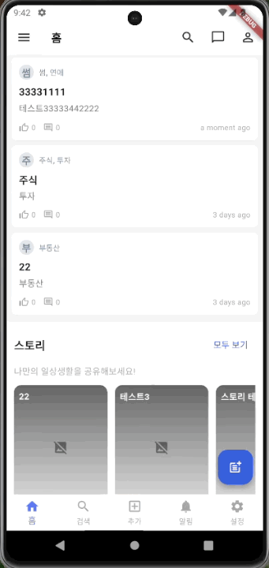
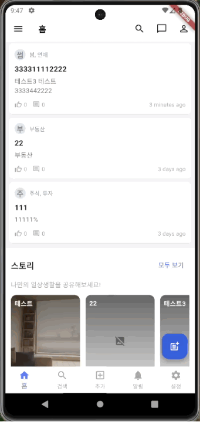
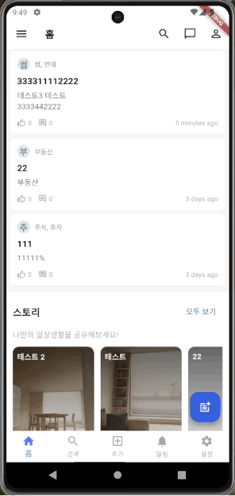
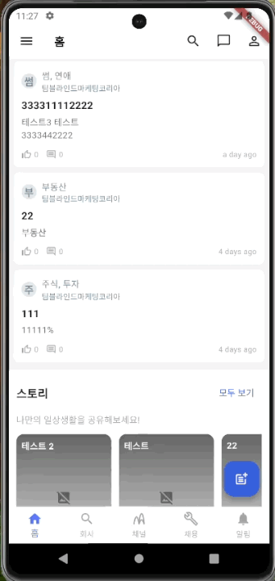
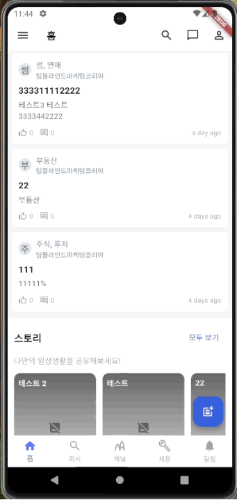
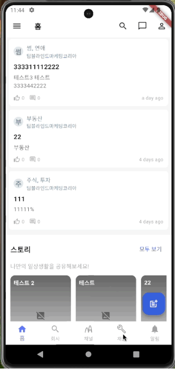
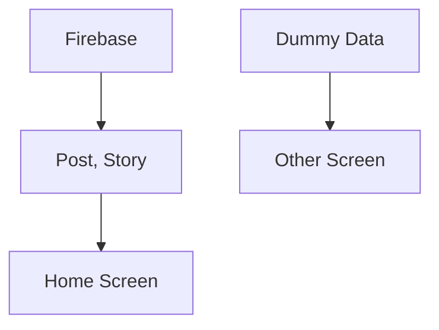

# Blind Clone
Blind Clone은 자주 사용하는 블라인드 커뮤니티 서비스를 클론 코딩한 프로젝트입니다.  
Firebase Realtime Database를 활용하여 게시글, 스토리 CRUD 기능을 구현했으며, 일부 화면은 Dummy Data를 활용해 UI를 구성했습니다.

## 📖 프로젝트 소개
- 커뮤니티 서비스 구조 학습을 목적으로 블라인드를 클론 개발
- Firebase Realtime Database를 통한 게시글 및 스토리 CRUD 구현
- 일부 화면은 Dummy Data를 활용하여 UI/UX 위주로 구성
- 개발자 관점에서 실제 서비스의 동작 원리와 데이터 흐름 이해도를 높이는 것을 목표로 진행

## 🛠 기술 스택
Framework : Flutter  
Language : Dart  
상태 관리 : Bloc  
DI : Provider  
etc : Firebase  

## ✨ 주요 기능
- 게시글 / 스토리 CRUD (Firebase 연동)
- Firebase API 호출 및 데이터 실시간 반영
- 이미지 라이브러리 연동 (스토리 이미지 업로드 기능)
- UI 구현 일부는 LLM 활용하여 디자인 최적화

## 🏞️ 화면

  
  
  
  

  
  
  
  

## 📊 플로우 차트
- Firebase Realtime Database
  - 홈 화면 데이터는 모두 Firebase API 호출을 통해 가져옴
  - Post & Story 데이터 CRUD 지원
- Dummy Data 활용
  - 일부 화면(UI 전용)은 Dummy Data로 구성하여 프로토타입 완성

## 👀 개발 과정에서 발생한 이슈

### 1. 스토리 화면 이미지 저장 방식 과금 이슈
- 이미지를 클라우드에 저장 후 URL 반환 방식으로 구현하려 했음
- 그러나 과금 이슈로 인해, 내부 저장소(Local Storage) 를 활용하는 방식으로 대체

