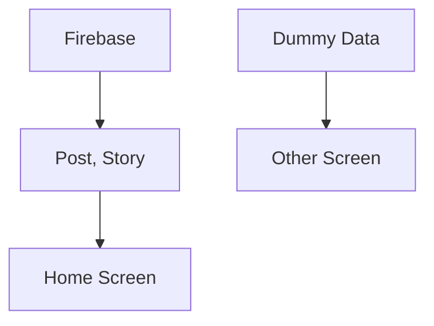

# Blind Clone

Blind Clone은 자주 사용하는 블라인드 커뮤니티 서비스를 클론 코딩한 프로젝트입니다.  
Firebase Realtime Database를 활용하여 게시글, 스토리 CRUD 기능을 구현했으며, 일부 화면은 Dummy Data를 활용해 UI를 구성했습니다.

## 📖 프로젝트 소개
- 커뮤니티 서비스 구조 학습을 목적으로 블라인드를 클론 개발
- Firebase Realtime Database를 통한 게시글 및 스토리 CRUD 구현
- 일부 화면은 Dummy Data를 활용하여 UI/UX 위주로 구성
- 개발자 관점에서 실제 서비스의 동작 원리와 데이터 흐름 이해도를 높이는 것을 목표로 진행

## 🛠 기술 스택
|Category|Technology|
|--------|----------|
|Framework|Flutter|
|Language|Dart|
|State Management|Bloc (Business Logic Component)|
|Dependency Injection|Provider (Repository Injection)|
|Backend / DB|Firebase Realtime Database|
|Image Loader|image_picker|

## ✨ 주요 기능 (Key Features)
### 1. 게시글 & 스토리 CRUD (Firebase)
- 실시간 데이터 동기화: Firebase Realtime Database를 활용하여 게시글과 스토리를 작성하면 즉시 피드(Feed)에 반영됩니다.
- 데이터 관리: 게시글 작성, 수정, 삭제 기능을 완벽하게 구현하여 동적인 커뮤니티 기능을 수행합니다.

### 2. 하이브리드 데이터 운용
- 핵심 기능: 게시글, 스토리 등 유저 상호작용이 필요한 부분은 실제 서버(Firebase)와 통신합니다.
- UI 프로토타이핑: 설정 화면이나 정적인 정보 화면은 Dummy Data를 효율적으로 활용하여 완성도 높은 UI/UX를 구성했습니다.

### 3. 스토리 이미지 업로드
- 미디어 처리: 디바이스 갤러리 접근 권한을 관리하고, 이미지를 선택하여 스토리에 업로드하는 기능을 구현했습니다.

### 4. 디자인 최적화
- LLM 활용: 일부 UI 컴포넌트 디자인 및 레이아웃 구성 단계에서 생성형 AI를 보조 도구로 활용하여 개발 생산성을 높이고 디자인 디테일을 챙겼습니다.

## 🏞️ 화면

  
  
  
  

  
  
  
  

## 📊 시스템 구조
- Firebase Realtime Database
  - 홈 화면 데이터는 모두 Firebase API 호출을 통해 가져옴
  - Post & Story 데이터 CRUD 지원
- Dummy Data 활용
  - 일부 화면(UI 전용)은 Dummy Data로 구성하여 프로토타입 완성

## 👀 개발 과정에서 발생한 이슈
### 1. 클라우드 스토리지 비용 문제와 로컬 저장소 전환
- 문제 상황:
초기 기획 단계에서는 스토리 기능을 위해 Firebase Storage에 이미지를 업로드하고 다운로드 URL을 받아오는 방식을 고려했습니다. 하지만 개인 학습용 프로젝트 특성상 클라우드 스토리지의 과금 문제 및 트래픽 제한이 우려되었습니다.
- 해결 방법:
서버 업로드 방식 대신 **내부 저장소(Local Storage)**를 활용하는 방식으로 설계를 변경했습니다.
image_picker를 통해 가져온 이미지의 로컬 경로(Path)를 데이터베이스에 저장하고, 앱 내부에서 해당 경로를 참조하여 이미지를 렌더링하는 방식으로 구현하여 비용 문제 없이 이미지 업로드 기능을 시뮬레이션했습니다.
(※ 향후 배포 단계에서는 AWS S3 또는 Firebase Storage로 마이그레이션 할 수 있도록 Repository 패턴으로 로직을 분리해 두었습니다.)

## 🎯 향후 계획 (Future Plans)
- Firebase Authentication: 이메일/회사 인증 로그인 기능 구현.
- Storage 마이그레이션: 로컬 경로 저장 방식을 실제 클라우드 스토리지 업로드 방식으로 전환.
- 댓글/대댓글 기능: 게시글에 대한 심도 있는 상호작용 기능 추가.
