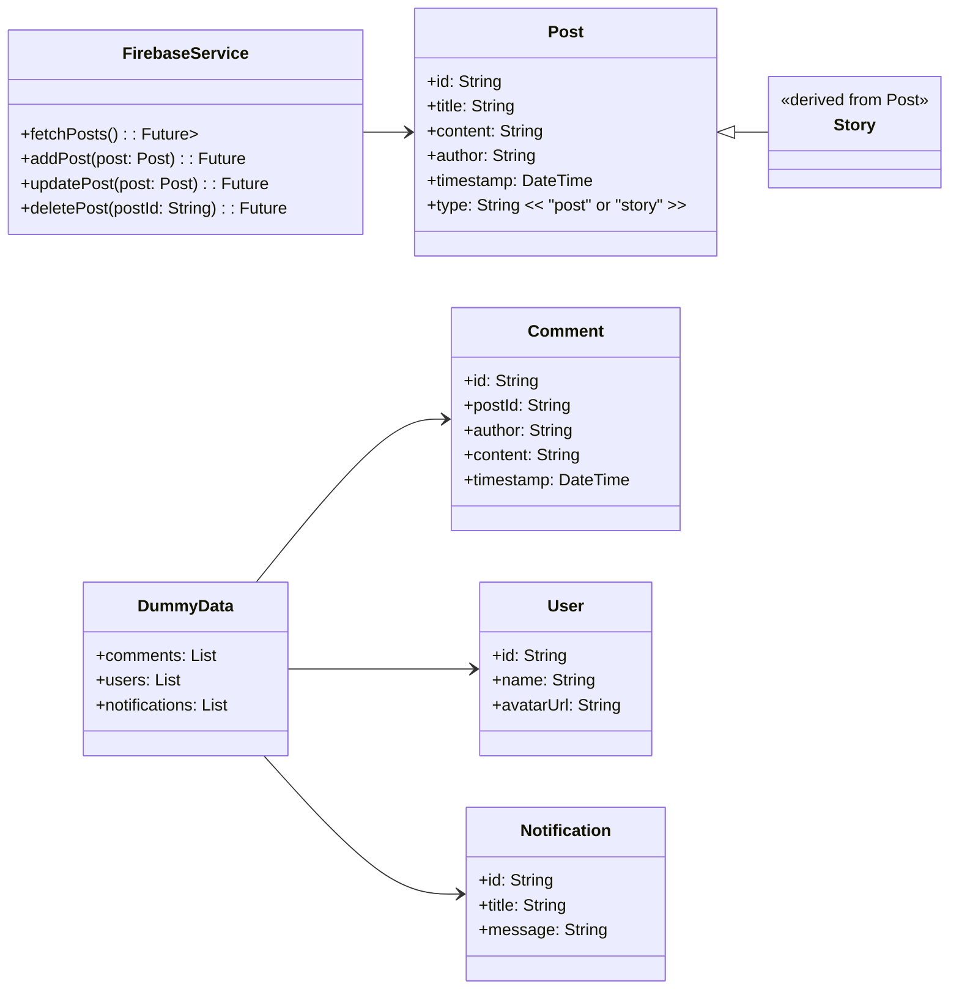

# Blind Clone

## 📖 프로젝트 소개

블라인드 서비스를 클론 코딩 하였습니다. Firebase Realtime Database를 활용해서 게시글, 스토리 등을 CRUD가 가능하도록 구현하였습니다.

## 🛠 기술 스택

Framework : Flutter  
Language : Dart  
etc : Firebase  

## ✨ 주요 기능

홈 화면에 작성한 글은 모두 Firebase Realtime Database로부터 가져온 것입니다. Firebase API 호출 기능, 이미지 라이브러리와 같은 기능을 구현하였습니다.
일부 디자인 관련 위젯은 LLM에 도움을 받아 구현하였습니다.

## 🏞️ 화면

  
  
  
  

  
  
  
  

## 👀 개발 과정에서 발생한 이슈

### 1. 스토리 화면 이미지 저장 방식 과금 이슈

스토리 화면을 클론 코딩 하면서 이미지를 클라우드에 저장해서 URL을 반환 받는 형식으로 만들고 싶었지만, 과금이 필요했기 때문에 내부 저장소 위치로 저장해서 구현하였습니다.

## :bar_chart 다이어그램

